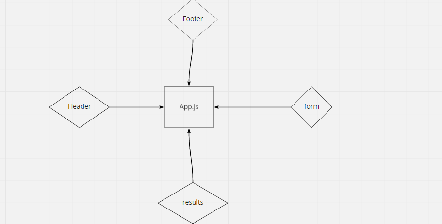

# Component Based UI

## Description

**we begin the first of a 4-Phase build of the RESTy application, written in React. In this first phase, our goal is to setup the basic scaffolding of the application, with intent being to add more functionality to the system as we go. This initial build sets up the file structure so that we can progressively build this application in a scalable manner**

 - *Begin with installing and running the application, making note of it’s architecture*
- *The App component serves as the container for all sub-components of this application Leave this component as a Class*

    
    - *The app imports an .scss file to serve as the base design for the site*
    - *Header, Footer, Results and Form components are imported from other files using ES6 import syntax*

- *Each of the components use their own .scss file for styling* 
- *The <Form> component should:*

    - *Call back to the <App/> component via function sent down through a prop so that the app can begin the process*
- *The <Results/> component should show mock API results*

## links
**link sandbox**  [https://codesandbox.io/s/recursing-wood-5p0rm](https://codesandbox.io/s/recursing-wood-5p0rm)

**link actions**   [https://github.com/amroalbarham/resty/actions](https://github.com/amroalbarham/resty/actions)

**link netlify**  [https://practical-fermat-1dc945.netlify.app/](https://practical-fermat-1dc945.netlify.app/)
## UML

